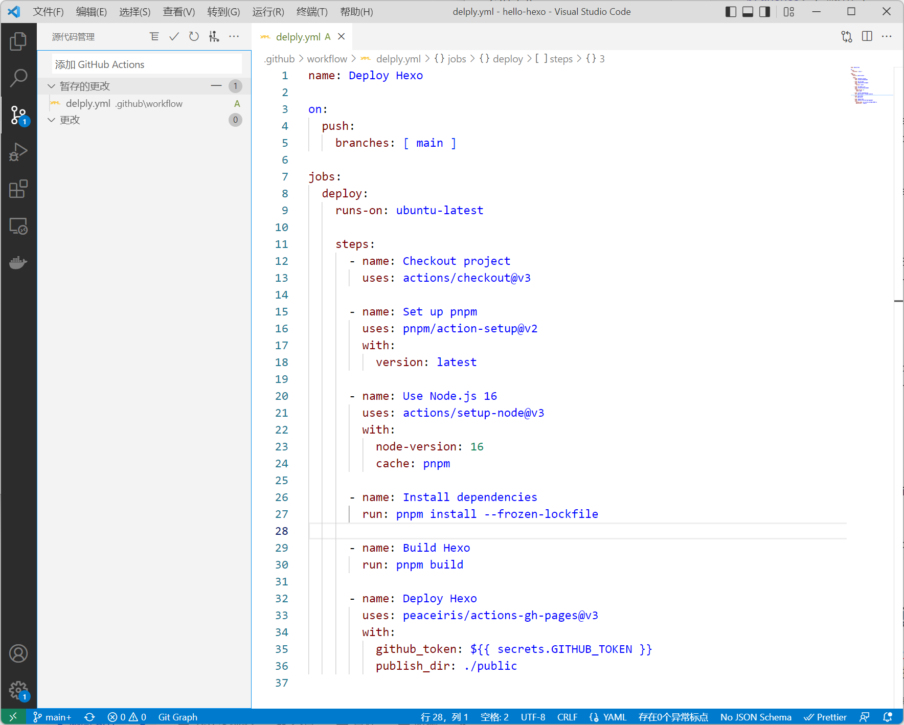
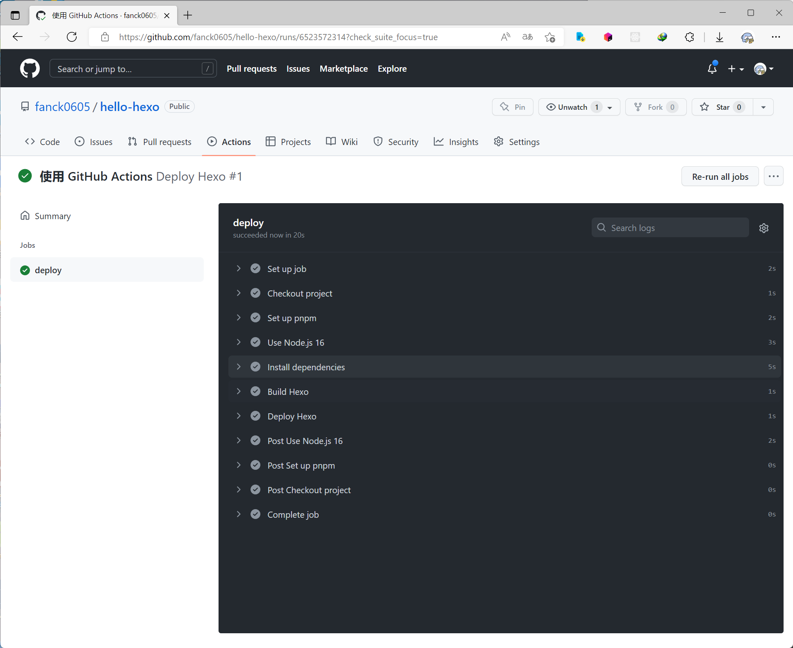
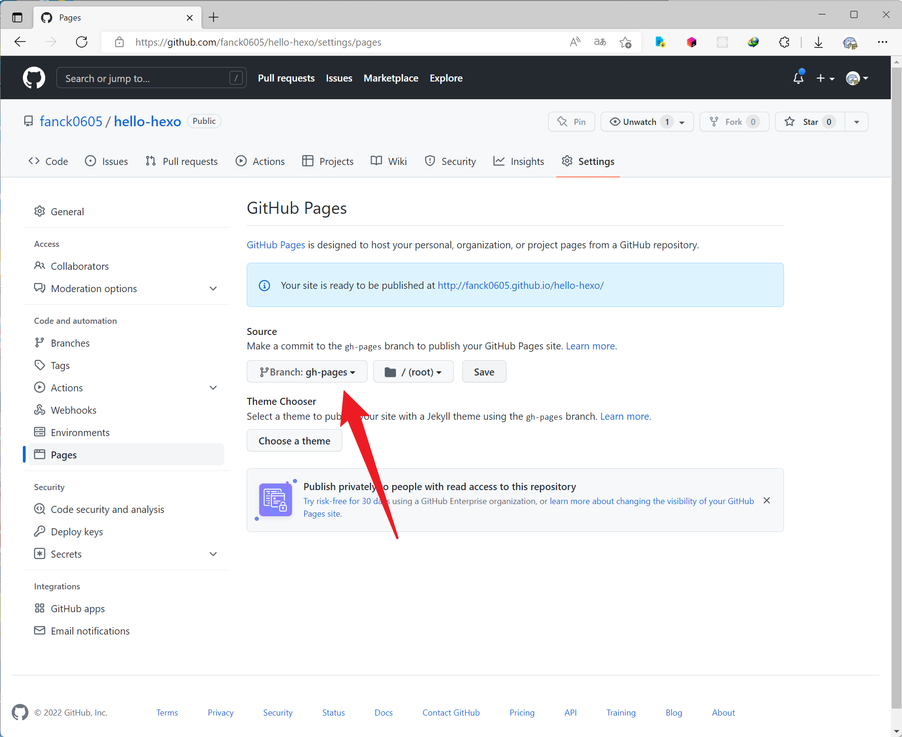

毕设也差不多快完工了，大学生活已经进入了尾声。大学四年，多多少少还是学习了不少编程知识，但是一直没有写一些文章把它们记录下来，还是有些可惜。 最近，终于下定决心开始写博客了，主要是为了记录一下自己的学习历程，也希望能给大家分享一点自己所学的知识。那么这次就直接从*使用 GitHub Actions 部署 Hexo 博客*开始吧。

## 什么是 Hexo?

[Hexo](https://github.com/hexojs/hexo) 是一个基于 Node.js 的静态博客框架。Hexo 框架可以根据博客源码（Markdown, EJS 等）自动生成静态网页网页，网页可以被直接被托管到 GitHub Pages 上面展示。同时，Markdown 格式的博文，很容易就可以存放到 Git 仓库中，进行版本管理。作为一个软件开发工程师，我觉得这是一个非常炫酷的功能，因此这次博客框架就使用它了。

## 创建 Hexo 项目

### 安装 Node.js 与 Git

Hexo 要求我们先安装 Node.js 与 Git，它们的安装包直接可以从官网下载。

- [Node.js](https://nodejs.org/zh-cn/)
- [Git](https://git-scm.com/)

安装完成后，在 Terminal 中验证一下安装，如果出现版本号，则表示安装成功。

```sh
node -v
git --version
```

### 初始化 Hexo 项目

为了更加方便地创建 Hexo 项目，首先需要安装 hexo-cli 工具。

```shell
npm install hexo-cli -g
```

选择一个你喜欢的目录，用于初始化 Hexo 博客。

```shell
hexo init hello-hexo
```

这将会创建一个 hello-hexo 的文件夹，里面就是博客源码。

进入 hello-hexo 文件夹，启动 Hexo 服务器。

```
cd hello-hexo
hexo server
```

运行成功后，就可以看到刚刚创建的博客了，界面如下：


### 第一篇博文

打开一个新的 Terminal 窗口，来创建属于我们的第一篇博客。

```
hexo new 'deploy hexo blog with github actions'
```

Markdown 格式的博客将被被生成到了 source/\_post/ 文件夹中，可以通过任意编辑器来编写它。

无需重启 Hexo 服务器，新的文章就可以在浏览器中被自动展示出来。

## 使用 GitHub Actions 自动部署 GitHub Pages

现在我们的网站只能在本地访问，通过将它部署到 GitHub Pages 上，我们就能在任意位置访问了。本次我们使用 GitHub Actions 来实现 Hexo 博客的自动部署。GitHub Actions 是 GitHub 提供的 CI/CD 工具，对于开源项目，它可以免费无限制的使用。

### 上传到 GitHub

首先，我们为 Hexo 项目添加一下 Git 支持。

```
# Ctrl + C 先关闭 hexo server
git init
git add .
git commit -m '首次提交'
```

然后去 GitHub 上创建一个对应的 Git 仓库。


将本地项目连接到 GitHub 仓库，并上传。

```
git remote add origin https://github.com/fanck0605/hello-hexo.git
git branch -M main
git push -u origin main
```

### 启用 GitHub Actions 写权限

公开的 GitHub 仓库，Actions 是没有写权限的，首先需要对 Actions 的权限进行配置，详见：[GitHub Actions: Control permissions for GITHUB_TOKEN](https://github.blog/changelog/2021-04-20-github-actions-control-permissions-for-github_token/)


### 编写 Actions 脚本

为了方便代码的编写，我们可以使用 VS Code 打开项目文件夹。


GitHub 与我们约定，放置在 Git 仓库 `.github/workflows` 下的 `.yml` 文件都会被识别为 Actions 脚本。对于 Hexo 博客的部署，我们只需要编写一个 `deploy.yml` 文件即可。具体如何编写，网上有非常多的教程，就不再赘述了，下面直接放出代码：

```yaml
// .github/workflows/deploy.yml
name: Deploy Hexo

on:
  push:
    branches: [ main ]

jobs:
  deploy:
    runs-on: ubuntu-latest

    steps:
      - name: Checkout project
        uses: actions/checkout@v3

      - name: Set up pnpm
        uses: pnpm/action-setup@v2
        with:
          version: latest

      - name: Use Node.js 16
        uses: actions/setup-node@v3
        with:
          node-version: 16
          cache: pnpm

      - name: Install dependencies
        run: pnpm install --shamefully-hoist --frozen-lockfile

      - name: Build Hexo
        run: pnpm build

      - name: Deploy Hexo
        uses: peaceiris/actions-gh-pages@v3
        with:
          github_token: ${{ secrets.GITHUB_TOKEN }}
          publish_dir: ./public
```

编写完毕后，可以直接在 VS Code 中，保存 Git 修改，然后 push 到服务器上。



在 Actions 选项卡中查看部署进度。



### 启用 GitHub Pages

部署完成后，将 GitHub Pages 设置为 gh-pages 分支。



等待几分钟，GitHub Pages 就能访问了，网站地址为：https://[用户名].github.io/[仓库名称]/


### 配置网站根目录

如果你的仓库名称不是 [用户名].github.io 那么你就需要配置 Hexo 的根路径。在 \_config.yml 中，将 root 设置为你的仓库名称。

```diff
root: /hello-hexo
```

保存后，将修改上传到 GitHub 上即可。

## 附：修复 Hexo 渲染问题（Workaround）

**2022-05-20 更新：问题已修复，主要是由于 [node-glob](https://github.com/isaacs/node-glob) 无法处理 windows 的路径分隔符导致的。**

最近（2022-05-14）几个版本的 Hexo 项目，使用 `hexo init` 创建完后，在 Windows 下，不能正常地进行界面渲染（[hexojs/hexo#4968](https://github.com/hexojs/hexo/issues/4968)），经过排查发现是新版本地 `stylus` 无法正常地编译 `.styl` 文件导致的。

最简单的解决方式就是将 `stylus` 替换成老版的，但是 `package.json` 中其实并没有手动引入 `stylus` 依赖，而是通过 `hexo-renderer-stylus` 间接引入的。在 pnpm 下，可以通过编写 [pnpm Hooks](https://www.pnpm.cn/pnpmfile) 来修改间接引入的依赖版本。代码如下：

```javascript
// .pnpmfile.cjs
function readPackage(pkg, context) {
  if (pkg.name === 'hexo-renderer-stylus') {
    pkg.dependencies = {
      ...pkg.dependencies,
      stylus: '0.54.5',
    };
    context.log(
      'stylus@^0.54.8 => stylus@0.54.5 in dependencies of hexo-renderer-stylus@v2.0.0'
    );
  }

  return pkg;
}

module.exports = {
  hooks: {
    readPackage,
  },
};
```
